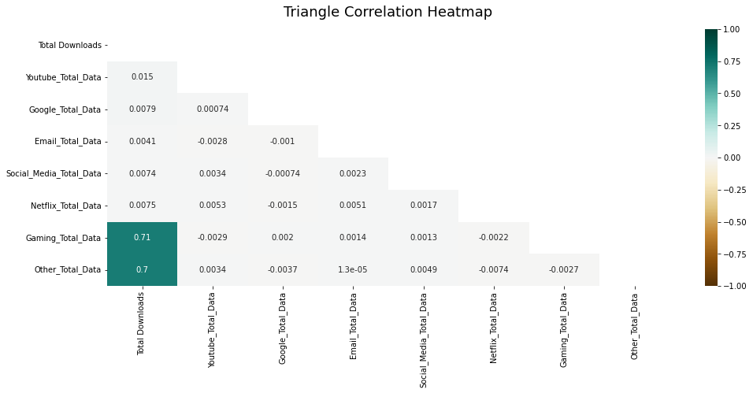

# telecom-user-analytics


This project will answer the questions:

* Is the telecommunications firm worth investing in/ or buying?
* Is there potential for the company to expand?

# Screenshots
### The top three apps utilized by this telecom company's customers

### The top five phones used by this telecom company's customers

### Data transfer coordination between several apps


# Setup
## Docker

You can run the dashboard using docker:

```bash
docker pull Amdeworkk21/tele_image:1.0
docker run Amdeworkk21/tele_image:1.0
```

## Installation for Windows

```bash
git clone https://github.com/Amdework21/Telecom-Data-Analysis.git
cd Telecom-Data-Analysis
pip install setup.py
```
## Data visualization link
[visualization link](https://amdework21-telecom-data-analysis-app-62wtq3.streamlitapp.com/)